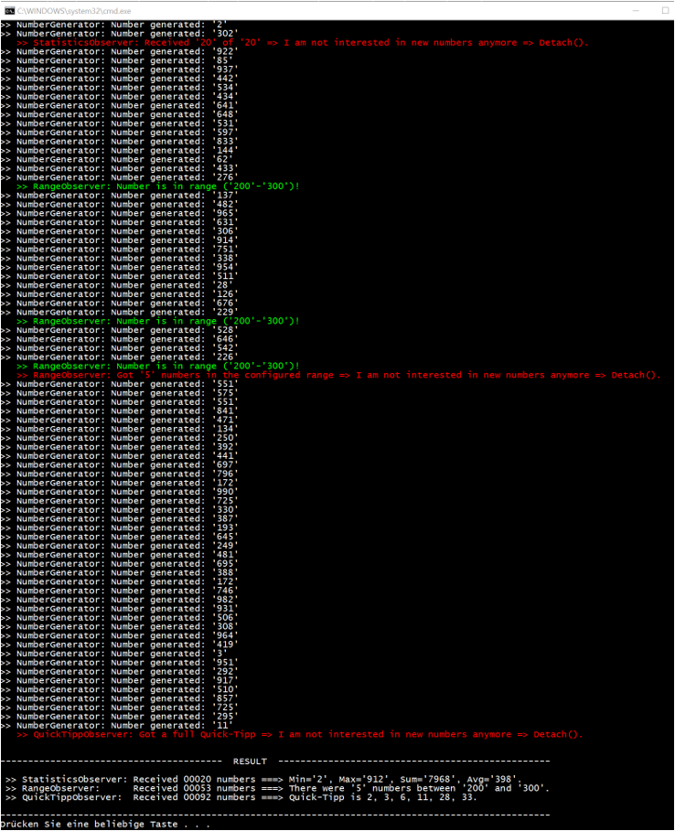
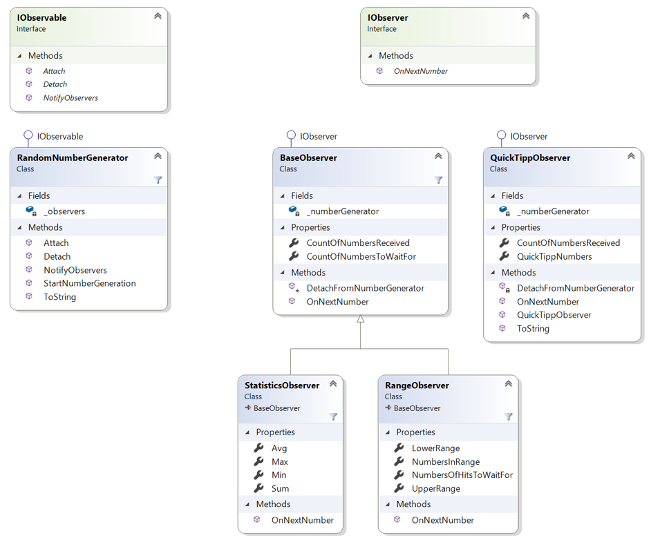

# Number Generator

## Lehrziele

* Wiederholung Objektorientierung
* Abgeleitete Klassen
* Collections: List<T>
* "Beobachter"-Muster


## Allgemeines

 Anhand des "Beobachter"-Musters ist ein Zahlengenerator (`RandomNumberGenerator`) zu implementieren welcher so lange Zufallszahlen erzeugt, solange Beobachter am Zahlengenerator registriert sind.

Folgende Beobachter sollen die generierten Zufallszahlen verarbeiten:

## BaseObserver

Dieser Beobachter dient als Basisklasse für spezialisiertere Beobachter und wird über den Konstruktur mit der Anzahl der zu beobachten Zahlen konfiguriert. Ist diese Anzahl erreicht, so meldet sich der BaseObserver selbstständig vom `RandomNumberGenerator` ab.


## StatisticsObserver

Aufgabe dieses Beobachters ist eine gewissen Anzahl an Zahlen (parametrisierbar über den Konstruktor) statistisch zu analysieren:

1.	`SUM`
1.	`AVG`
1.	`MIN`
1.	`MAX`

Nachdem die gewünschte Anzahl an Zufallszahlen verarbeitet wurde, meldet sich auch der `StatisticsObserver` selbstständig vom `RandomNumberGenerator` ab.

## RangeObserver

Dieser Beobachter wird mit einer unteren Schranke, einer oberen Schranke und der Anzahl der gewünschten Treffer im Bereich per Konstruktor konfiguriert und zählt alle Zufallszahlen, die in diesen Bereich fallen. Wenn die gewünschte Trefferanzahl erreicht ist, meldet sich der RangeObserver selbstständig von der weiteren Benachrichtigung beim `RandomNumberGenerator` ab.

## QuickTippObserver

Die Aufgabe dieses Beobachters ist es so lange Zufallszahlen zu "empfangen", bis dass ein vollständiger QuickTipp erkannt wurde (6 eindeutige Zahlen im Bereich von 1 bis 45). Danach meldet sich der Beobachter selbstständig vom Empfang weiterer Zufallszahlen ab.

 
# Konsolenprogramm

Neben den Unittests, welche die grundlegende Funktionalität abprüfen soll auch eine Konsolenapplikation implementiert werden, welche die Funktionsweise der verschiedenen Beobachter demonstriert und deren Ausgaben ähnlich zu diesem Screenshot sind:



# Klassendiagramm



# Hinweise

* Die `Observer` ("Beobachter") registrieren sich selbstständig beim `Observable` (`RandomNumberGenerator`).

* Sobald ein `Observer` "Beobachter" an keinen weiteren Zufallszahlen mehr interessiert ist meldet sich dieser selbständig beim `Observable` (`RandomNumberGenerator`) ab.

* Der `RandomNumberGenerator` erzeugt so lange Zufallszahlen, so lange interessierte Beobachter angemeldet sind!

* Der `RandomNumberGenerator` verwendet zur Erzeugung der (Pseudo-)Zufallszahlen die Klasse `Random`. Verwenden Sie zur Initialisierung des `Random`-Objekts die per `RandomNumberGenerator`-Konstruktor zur Verfügung gestellte `Seed` ([Dokumentation](https://docs.microsoft.com/en-us/dotnet/api/system.random.-ctor?view=netcore-3.0#System_Random__ctor_System_Int32_)). Dies ist wichtig, da ansonsten die in den Unittests erwarteten Ergebnisse nicht eintreffen!	

* Die Zufallszahlen sollen im Bereich zw. 1 und 999 liegen:
  
  ``` cs
  int generatedNumber = _random.Next(RANDOM_MIN_VALUE, RANDOM_MAX_VALUE);
  ```

* Zwischen den einzelnen Generierungsvorgängen wartet der RandomNumberGenerator eine gewisse Anzahl an Millisekunden (Konfiguration per Konstruktor):

  ``` cs
  Task.Delay(_delay).Wait;
  ```

* Die Generierung der Zufallszahlen wird per Methodenaufruf `StartNumberGeneration()` am `RandomNumberGenerator` gestartet.

* Beachten Sie die Vererbungshierarchie der "Beobachter". Haben Sie einen Tipp um in der Implementierung Codeverdoppelung zu vermeiden?

* Achtung: Unit-Tests dürfen nicht verändert werden! Beachten Sie bei der Wahl der Bezeichner (Methoden-, Variablennamen, etc.) das Klassendiagramm bzw. die Unit-Tests.
